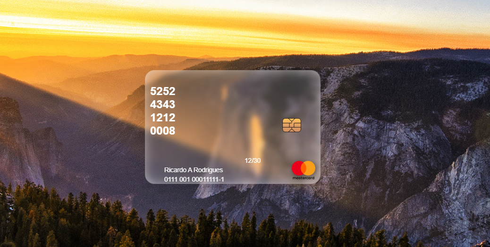

<h1 align="center"> carrosel giratorio </h1>

  

## 🚀 Tecnologias

Esse projeto foi desenvolvido com as seguintes tecnologias:

- HTML e CSS
- Git e Github

## 💻 Projeto

feito por:

♥ Ricardo Antonio Rodrigues
